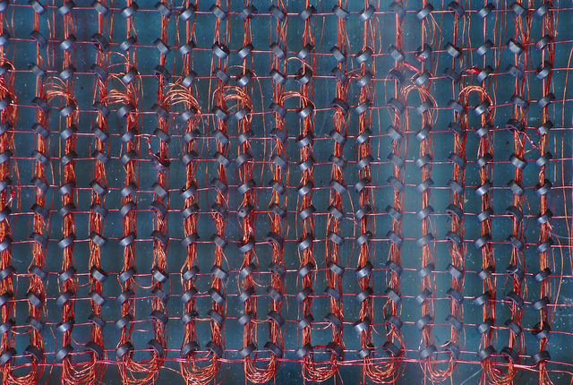

# Arrays and Lists

Arrays are collections of things that belong together. They are also known as lists.

Arrays are found all over math and science. We have collections of antennas, called \"[antenna arrays](https://en.wikipedia.org/wiki/Antenna_array),\" that are used for listening to things far away.

<figure>

<figcaption>HAARP, a phased array of 180 crossed dipoles in Alaska which can transmit a 3.6 MW beam of 3–10 MHz radio waves into the ionosphere for research purposes</figcaption>
</figure>

We have arrays of phone switches.

<figure>

<figcaption>New York telephone exchange with array of telephone switches in the 1880s, with both men and women as operators</figcaption>
</figure>

We have arrays of computer memory.

<figure>

<figcaption>Memory ferrite cores. Non-volatile computer memory with ferrite cores, invented in the late 1940s and used until the 1960s. By <a href="https://www.flickr.com/photos/zigazou76/">Frédéric BISSON</a>, <a href="https://www.flickr.com/photos/zigazou76/5022950317/in/photolist-8DRW8F-8DV1bU-7qXqbL-7jdoe3-mLMXHV-dPcqJ1-74CAVD-dtmAgu-9N2XN6-4WsNf6-2eiJRUg-9N4sor-jR9gc-C4XWX-6toLje-so5Nwj-PxCF2-bTMzmB-7MJHYH-74CAGV-7MJKMc-75f2zt-7MJJrp-5FtAwP-6RDjx-bAmG9G-efemni-poeUX7-ecFG8s-9F2vmv-dsShAU-2a1bPB-dsShTJ-asbxKJ-o5y8DJ-4nhEfZ-aSvDvT-a9H6Y-6tsUEd-3L3GGc-4zBqCp-4oqcc3-f41oVW-7o2YGP-bWzgc7-dsSidj-686HoR-e49fQN-7ihCSj-87Lwon/">CC BY 2.0</a></figcaption>
</figure>

Students who have worked with multiplication are introduced to arrays that look like this.

<figure>

<figcaption>Math array used for multiplication. Credit: <a href="https://svgsilh.com/673ab7/image/26436.html">SVG Silh</a>, <span class="title-ref">CC0 1.0</span></figcaption>
</figure>

The items in your array belong together. 

You can think of your kitchen as a collection of arrays. The refrigerator is an array of things that need to stay cool. The freezer is an array of things that need to stay frozen. The pantry is an array of food that can be room temperature. You have an array of plates, an array of cups and glasses, an array of eating utensils, an array of towels, an array of spices, and so on.

Arrays also have a size. In my array of cereal, I have 4 boxes of cereal. In my array of silverware, I have arrays of forks (8), salad forks (8), tea spoons (8), soup spoons (7), butter knives (8), and steak knives (8).

In simple arrays like above, each item is in a numbered slot called a `key` or an `index`. In most programming languages, arrays start at zero (`0`) and count upward until you get to one less than the size of the array. So, for an array of 8 spoons, you would count them as \"spoon 0, spoon 1, spoon 2, spoon 3, spoon 4, spoon 5, spoon 6, and spoon 7.\" In a Scratch list, you start counting at 1. This can get confusing, but it\'s important to understand if that\'s how items are arranged in the programming language that you are using, because you get the item in a simple array by its key number.

```javascript
const movies = [
    'Black Panther',
    'Coco',
    'A Wrinkle in Time'
];

const firstMovie = movies[0];
```

What happens when we `console.log(movies[0])`?

We can also have an array of arrays. This is called a "multi-dimensional array." Imagine a box of donuts. There are probably 12 donuts in that box of donuts. So, you might have:

```javascript
let donuts = [
    'd1', 'd2',  'd3',  'd4', // row of plain glazed
    'd5', 'd6',  'd7',  'd8', // row of chocolate icing
    'd9', 'd10', 'd11', 'd12' // three bear claws and a jelly donut
];
```

The third donut in that box is `donuts[2]` since we start counting in arrays at zero. But we know that we actually have 3 rows of 4 donuts in this box of donuts:

```javascript
let donuts = [
    ['d1', 'd2',  'd3',  'd4' ],
    ['d5', 'd6',  'd7',  'd8' ],
    ['d9', 'd10', 'd11', 'd12']
];
```

Now, getting that third donut would require us to identify which row it's in, too.

So our donut is in `donuts[0][2]`.

Quiz: I love jelly donuts, which `d12` is. How do I get the last donut?

```javascript
donuts[x][y];
```

What is `x`? What is `y`?

<u>Bonus Question:</u> If I had 10 rows of 12 donuts each, how would I get the last donut?

```javascript
let donuts = [
    ['d1',   'd2',   'd3',   'd4',   'd5',   'd6',   'd7',   'd8',   'd9',   'd10',  'd11',  'd12'],
    ['d13',  'd14',  'd15',  'd16',  'd17',  'd18',  'd19',  'd20',  'd21',  'd22',  'd23',  'd24'],
    ['d25',  'd26',  'd27',  'd28',  'd29',  'd30',  'd31',  'd32',  'd33',  'd34',  'd35',  'd36'],
    ['d37',  'd38',  'd39',  'd40',  'd41',  'd42',  'd43',  'd44',  'd45',  'd46',  'd47',  'd48'],
    ['d49',  'd50',  'd51',  'd52',  'd53',  'd54',  'd55',  'd56',  'd57',  'd58',  'd59',  'd60'],
    ['d61',  'd62',  'd63',  'd64',  'd65',  'd66',  'd67',  'd68',  'd69',  'd70',  'd71',  'd72'],
    ['d73',  'd74',  'd75',  'd76',  'd77',  'd78',  'd79',  'd80',  'd81',  'd82',  'd83',  'd84'],
    ['d85',  'd86',  'd87',  'd88',  'd89',  'd90',  'd91',  'd92',  'd93',  'd94',  'd95',  'd96'],
    ['d97',  'd98',  'd99',  'd100', 'd101', 'd102', 'd103', 'd104', 'd105', 'd106', 'd107', 'd108'],
    ['d109', 'd110', 'd111', 'd112', 'd113', 'd114', 'd115', 'd116', 'd117', 'd118', 'd119', 'd120']
];
```

**Scratch**

See info about the Scratch version of an array, the [list block](https://en.scratch-wiki.info/wiki/Scratch_Wiki:Table_of_Contents/List_Blocks).

## Example Projects

- Scratch: Eric P. [My Favorite Movie](https://scratch.mit.edu/projects/124673619/)
- Scratch: Aaron O. [Asteroids](https://scratch.mit.edu/projects/197718744/)

## Project Ideas

- [Mad Libs](https://en.wikipedia.org/wiki/Mad_Libs)
- Inventory list in a game
- Last 3 high scores