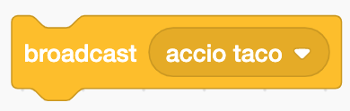
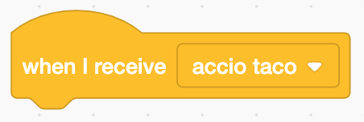

# Broadcast/Receive Events

Today we are going to flex our magic code muscles and look at events in JavaScript, or as they are known in Scratch: broadcast/receive. In some programming languages, this concept is also known as publish/subscribe.

On a web page or in a game, clicking on a button requires an action or an event. We call this an `on-click` `event`.

In Scratch, an action will broadcast a message that another part of the program is listening for. Once that message is received, an action will take place.

For example - "OK, I now know that the red button was clicked, so I will ignite the rocket." In Scratch, you would use the "Events" blocks for "broadcast" and "receive." In JavaScript, you might use the `event` for `on-click` and run a `function`.

In a way, this is like casting a spell. You say the words or make the right motion and the appropriate action takes place. I could say "Accio taco!" and wave my arms just so and a taco from my favorite taco stand would fly into my hands.

"Accio taco" is the Scratch Broadcast or the JavaScript event.



Here, I might display a text bubble in Scratch when my sprite receives the broacast.



### JavaScript Events

If you are viewing these docs on the CoderDojo website, the `iframe`s below will render a [JSFiddle](https://jsfiddle.net/).

<iframe width="100%" height="300" src="https://jsfiddle.net/lioninawhat/vdj62obh/embedded/" allowfullscreen="allowfullscreen" allowpaymentrequest frameborder="0"></iframe>

```html
<html>
    <head>
        <title>Button Event Listener Demo</title>
    </head>
    <body>
        <button>Want some treasure?</button>
    </body>
</html>
```

```javascript
document.addEventListener('DOMContentLoaded', (event) => {
    // Here, the event is `onclick` and the action is an alert.
    let btn = document.querySelector('button');

    btn.onclick = function() {
        alert('Fortune favors the bold.');
    }
});
```

Here, a JavaScript function is called when the event happens.

And here's a more complex example with a color slider, buttons, and inline `onclick` handlers. [Click here to view the source.](examples/input-button.html)

<iframe width="100%" height="300" src="https://jsfiddle.net/lioninawhat/u2Lozmae/embedded/" allowfullscreen="allowfullscreen" allowpaymentrequest frameborder="0"></iframe>

## Example Projects

- Scratch: Eric P. [Summon Taco](https://scratch.mit.edu/projects/236373793/)
- Scratch: KP [Goal](https://scratch.mit.edu/projects/236403174/)
- JavaScript: [Events Garden](examples/events-garden.html)

## Project Ideas

- Tell a story with two characters talking back and forth.
- Create a [Rube Goldberg Machine](https://www.digitaltrends.com/cool-tech/best-rube-goldberg-machines/) where the completion of each step is a broadcast to tell the next step to begin.
- Build a sound effects machine where each button is associated with a different sound - like an instrument!