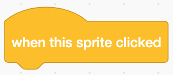

# User Input: Buttons

If you ask almost any developer-mentor in the CoderDojo who they write programs for, they will all tell you that they write them for clients, other people. All of these programs rely upon input from those other people in order to be useful. If you think about the games that you love to play, those games are fun to play because they rely upon some kind of input from you --- it could be the press of a button, wiggling a joystick, or typing an answer. Today, we'll look at the a user selecting an option in order to provide input for your program.

In Scratch, we have one way of getting user input as a selection, in the form of a button:



This will fire an event that you can act upon. Whatever code is attached to this block will run when this sprite is clicked.

In JavaScript, you can get user input by using a form. A form can take in text, ask questions where the user has to select either \"yes\" or \"no,\" offer a dropdown list for users to select one or more options, and others. Each form part should have a unique ID since that the answer to that part of the form will be tied to the ID.

```html
<input type="text" id="place">
<button type="submit" id="submit">Submit</button>
```

In JavaScript, you can get user input by using a form. A form can take in text, ask questions where the user has to select either "yes" or "no," offer a dropdown list for users to select one or more options, and others. Each form part should have a unique ID since that the answer to that part of the form will be tied to the ID.

```html
<input type="radio" id="firstGroup" value="2019">
    October 14, 2019
</input>
<button type="submit" id="submit">Submit</button>
```

In JavaScript, you would then pull information out of that form to be used in your code. You can do that by assigning the data tied to those form group IDs to variables.

```javascript
var answer = document.querySelector("#firstGroup");

//You can then check the answer by using an if-statement.
if (answer == "2019") {
    doSomething();
}
```

The Mozilla Developer Network has a [great introduction to forms](https://developer.mozilla.org/en-US/docs/Learn/HTML/Forms) if you\'d like to learn more about creating forms in HTML.

You can also have your buttons do interesting things. For instance, you can have buttons change your background color.

```html
<button id="red" onclick="redder()">More Red</button>
```

```javascript
var red = 0;
var green = 0;
var blue = 0;

function updateBackground(red, green, blue) {
    document
        .querySelector('body')
        .style.backgroundColor
            = "rgb(" + red + "," + green + "," + blue + ")";
}

function redder() {
    this.red = this.red <= 250 ? this.red + 10 : 0;

    this.updateBackground(this.red, this.green, this.blue);
}
```

### JS Button Code Example

[Click here to view the source.](examples/input-button.html)

If you are viewing these docs on the CoderDojo website, the `iframe` below will render a [JSFiddle](https://jsfiddle.net/).

<iframe width="100%" height="300" src="//jsfiddle.net/lioninawhat/u2Lozmae/embedded/" allowfullscreen="allowfullscreen" allowpaymentrequest frameborder="0"></iframe>

## Example Projects

- Scratch: [Magic School](https://scratch.mit.edu/projects/120685711/)
- Scratch: Lucas F. [Windows 9 1.1](https://scratch.mit.edu/projects/250679362/)
- Scratch: John M. [Button Blast](https://scratch.mit.edu/projects/252270787/)

## Project Ideas

- calculator
- [Simon](https://en.wikipedia.org/wiki/Simon_(game))
- Jumping game