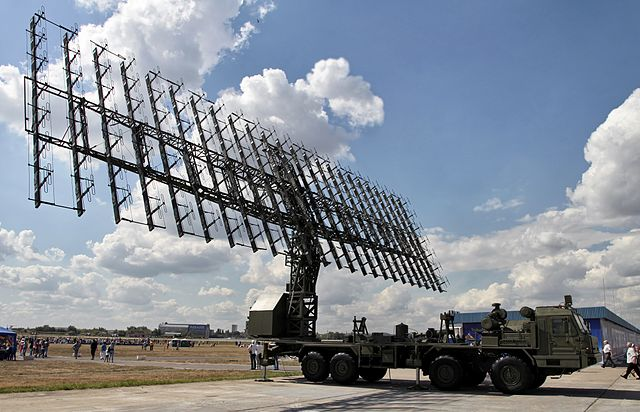
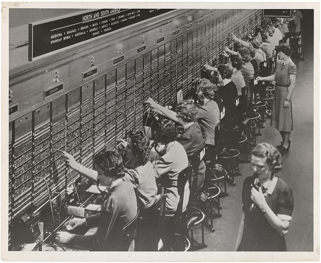

# Arrays and Lists

Arrays are collections of things that belong together. Arrays are found all over math and science. We have collections of antennas, called \"[antenna arrays](https://en.wikipedia.org/wiki/Antenna_array),\" that are used for listening to things far away.

<figure>

<figcaption>Large planar array antenna of a VHF Russian mobile air defense radar, the Nebo-M. It consists of 175 folded dipole antennas driven in phase. It radiates a narrow beam of radio waves perpendicular to the antenna. By <a href="http://vitalykuzmin.net/?q=node/469">Vitaly V. Kuzmin</a>, <a href="https://commons.wikimedia.org/w/index.php?curid=21027006">CC BY-SA 4.0</a></figcaption>
</figure>


We have arrays of phone switches.


<figure>

<figcaption>Array of telephone switches and their operators during WWII. Credit: <a href="http://research.archives.gov/description/1633445">U.S. National Archives</a></figcaption>
</figure>


We have arrays of computer memory.


<figure>

<figcaption>Memory ferrite cores. Non-volatile computer memory with ferrite cores, invented in the late 1940s and used until the 1960s. By <a href="https://www.flickr.com/photos/zigazou76/">Frédéric BISSON</a>, <a href="https://www.flickr.com/photos/zigazou76/5022950317/in/photolist-8DRW8F-8DV1bU-7qXqbL-7jdoe3-mLMXHV-dPcqJ1-74CAVD-dtmAgu-9N2XN6-4WsNf6-2eiJRUg-9N4sor-jR9gc-C4XWX-6toLje-so5Nwj-PxCF2-bTMzmB-7MJHYH-74CAGV-7MJKMc-75f2zt-7MJJrp-5FtAwP-6RDjx-bAmG9G-efemni-poeUX7-ecFG8s-9F2vmv-dsShAU-2a1bPB-dsShTJ-asbxKJ-o5y8DJ-4nhEfZ-aSvDvT-a9H6Y-6tsUEd-3L3GGc-4zBqCp-4oqcc3-f41oVW-7o2YGP-bWzgc7-dsSidj-686HoR-e49fQN-7ihCSj-87Lwon/">CC BY 2.0</a></figcaption>
</figure>


Kids who have worked with multiplication are introduced to arrays that look like this.


<figure>

<figcaption>Math array used for multiplication. Credit: <a href="https://svgsilh.com/673ab7/image/26436.html">SVG Silh</a>, <span class="title-ref">CC0 1.0</span></figcaption>
</figure>


The items in your array belong together. Think of your kitchen as a collection of arrays. The refrigerator is an array of things that need to stay cool. The freezer is an array of things that need to stay frozen. The pantry is an array of food that can be room temperature. You have an array of plates, an array of cups and glasses, an array of eating utensils, an array of towels, an array of spices, etc.

Arrays also have a size. In my array of cereal, I have 4 boxes of cereal. In my array of silverware, I have arrays of forks (8), salad forks (8), tea spoons (8), soup spoons (7), butter knives (8), and steak knives (8).

In simple arrays like above, each item is in a numbered slot called a \"key\" or an \"index.\" In most programming languages, arrays start at zero (0) and count upward until you get to one less than the size of the array. So, for an array of 8 spoons, you would count them as \"spoon 0, spoon 1, spoon 2, spoon 3, spoon 4, spoon 5, spoon 6, and spoon 7.\" In a Scratch list, you start counting at 1. This can get confusing, but it\'s important to understand if that\'s how items are arranged in the programming language that you are using, because you get the item in a simple array by its key number.

``` javascript
var movies = [
  "Black Panther",
  "Coco",
  "A Wrinkle in Time"
];

// the first movie in this list, "Black Panther," is:
var firstMovie = movies[0];
```

We can also have an array of arrays. This is called a \"multi-dimensional array.\" Imagine a box of donuts. There are probably 12 donuts in that box of donuts. So, you might have:

``` javascript
var donuts = [
  "d1", "d2",  "d3",  "d4",
  "d5", "d6",  "d7",  "d8",
  "d9", "d10", "d11", "d12"
];
```

The third donut in that box is donuts\[2\] since we start counting in arrays at zero. But we know that we actually have 3 rows of 4 donuts in this box of donuts:

``` javascript
var donuts = [
  ["d1", "d2",  "d3",  "d4" ],
  ["d5", "d6",  "d7",  "d8" ],
  ["d9", "d10", "d11", "d12"]
];
```

Now, getting that third donut would require us to identify which row it\'s in, too: *donuts[0][2]*

Question: how do I get the last donut?

``` javascript
donuts[x][y]; // what is "x"? what is "y"?
```

Bonus Question: if I had 10 boxes of 12 donuts, how would I get the last donut?

``` javascript
donuts[x][y][z]; // what is "x"? "y"? "z"?
```

Bonus Question, just for Jenna:

``` javascript
// What did Hagrid say to:

[
    'Dumbledore',
    'McGonagall',
    'Snape',
    'Moody',
    'Tonks',
    'Black',
    ...
]; // ?

console.log("You're a wizard array");
```

**Scratch**

See info about the Scratch version of an array, the [list block](https://en.scratch-wiki.info/wiki/Scratch_Wiki:Table_of_Contents/List_Blocks).

## Example Projects

-   Scratch: [My Favorite Movie](https://scratch.mit.edu/projects/124673619/)
-   Scratch: Adam P. [Eevee Mixer](https://scratch.mit.edu/projects/199891352/)
-   Scratch: Aaron O. [Asteroids](https://scratch.mit.edu/projects/197718744/)

## Project Ideas

-   [Mad Libs](https://en.wikipedia.org/wiki/Mad_Libs)
-   Inventory list in a game
-   Last 3 high scores