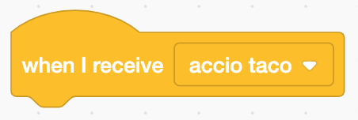

# Broadcast/Receive Events

Today we are going to flex our code-magic muscles and look at events, broadcast/receive (aka publish/subscribe). On a web page or in a game, clicking on a button requires an action or an event (let's call it "on-click"); that action will broadcast a message (ex. "HEY! The red button was clicked!") that another part of the program is listening for. Once that message is received, an action will take place (ex. "OK, I now know that the red button was clicked, so I will ignite the rocket"). In Scratch, you would use the "Events" blocks for "broadcast" and "receive." In JavaScript, you might use the event for "onclick" and run a function.

In a way, this is like casting a spell. You say the words or make the right motion and the appropriate action takes place. I could say "Accio taco!" and wave my arms just so and a taco from my favorite taco stand would fly into my hands. "

\"Accio taco" is the Scratch Broadcast or the JavaScript event.

{width="640px"}

The taco flying to me would be the Scratch "when I receive" or the JavaScript function that is called when the event happens.

{width="640px"}

## Example Projects

-   Scratch: [Summon Taco](https://scratch.mit.edu/projects/236373793/)
-   Scratch: KP [Goal](https://scratch.mit.edu/projects/236403174/)
-   JavaScript: [Events Garden](http://coderdojokc.com/wp-content/uploads/2017/04/events-garden.html)

## Project Ideas

-   Tell a story with 2 characters talking back and forth
-   Create a [Rube Goldberg Machine](https://www.digitaltrends.com/cool-tech/best-rube-goldberg-machines/) where the completion of each step is a broadcast to tell the next step to begin.
-   Build a sound-effects machine where each button is associated with a different sound.