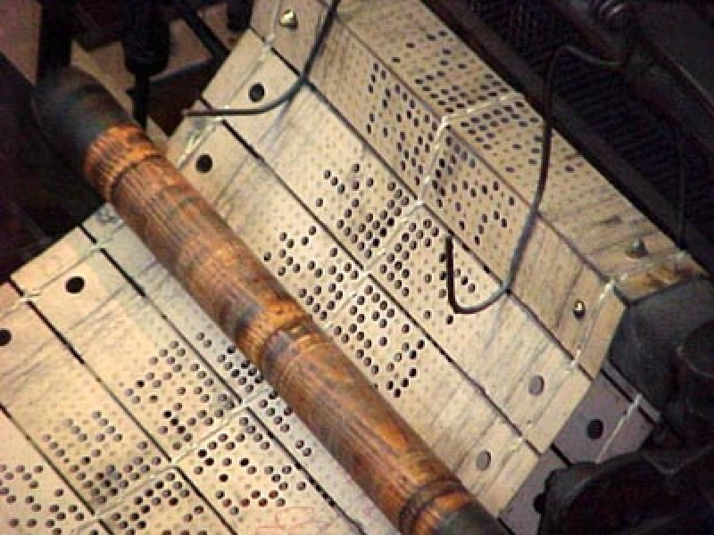
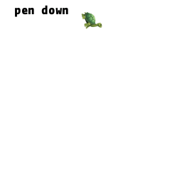
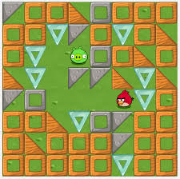
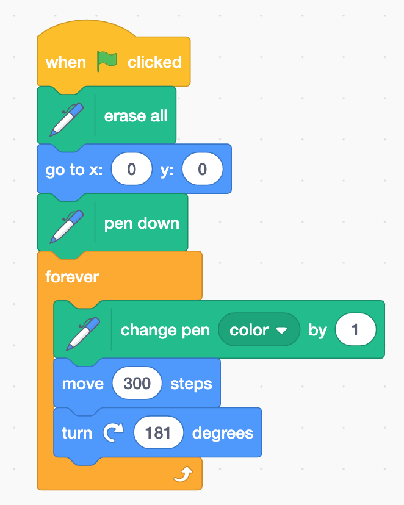

# Drawing with Code

Up through the mid-20th Century, software was written by punching holes in cards in specific patterns and feeding those cards into a computer in a specific order.

{width="640px"}

Computers were largely used for analyzing data and calculating mathematical problems. Yet, a little over 200 years ago, a precursor to the modern computer was used to create art and used punched cards to do so. The [Jacquard Loom](https://en.wikipedia.org/wiki/Jacquard_machine) was a 2-story tall loom that was used to create elaborate weavings and used holes punched in cards in specific patterns and feeding those cards in a specific order to create those beautiful patterns.

{width="640px"}

Art and computers go way back. One of the earliest programming languages created for learning how to program was [Logo](https://en.wikipedia.org/wiki/Logo_(programming_language)), released in 1967.

{width="640px"}

Introduced with the Logo programming language, was the idea of a Turtle as a robot to draw out the programmed image. The image is programmed as a series of moves and turns with the \"pen\" up or down on the \"paper\" and drawn accordingly.

<figure>

<figcaption>Image courtesy of <a href="https://commons.wikimedia.org/wiki/File:Turtle-animation.gif">Wikipedia</a>. An animation that shows how the turtle is used to create graphics by combining forward and turn commands. (This is not actual Logo, but pseudo-code Logo.) <a href="https://commons.wikimedia.org/wiki/Category:CC-BY-SA-4.0">CC by SA 4.0</a></figcaption>
</figure>

Today, one might see the same kind of programming on the [Code.org](https://code.org/) implementation of [Hour of Code](https://hourofcode.com).

{width="225px"}

In [Scratch](https://scratch.mit.edu), we can draw using a Logo-like syntax. If you imagine the screen as paper and the sprite as the pen, \"pen up\" and \"pen down\" are concepts that are not that far fetched. In Scratch, we have \"pen\" options like \"erase all,\" \"pen up,\" \"pen down,\" and \"pen color.\"

We can move a penned sprite 300 steps, turn 181 degrees, move 300 steps, and keep repeating. Example: [Colorful Circle Using Straight Lines](https://scratch.mit.edu/projects/335837527/)

{width="640px"}

What do you think you can draw with a coded pen and a few simple commands?

## Example Projects

-   Scratch: [Pen Experiment](https://scratch.mit.edu/projects/335825017/)
-   Scratch: [Laser Cat](https://scratch.mit.edu/projects/24928894/)
-   Scratch: [Colorful Circle Using Straight Lines](https://scratch.mit.edu/projects/335837527/)

## Project Ideas

-   Draw polygons
-   Random art generator
-   [Cycle game](http://cycleblob.com/)