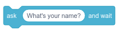
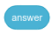
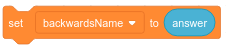

# User Input: Text

If you ask almost any developer-mentor in the CoderDojo who they write programs for, they will all tell you that they write them for clients, other people. All of these programs rely upon input from those other people in order to be useful. If you think about the games that you love to play, those games are fun to play because they rely upon some kind of input from you --- it could be the press of a button, wiggling a joystick, or typing an answer. Today, we'll look at the a user typing in text in order to provide input for your program.

In Scratch, we have one way of getting user input as text:

{width="640px"}

This will ask for input and store that input as an answer variable that you can use later.

{width="300px"}

If you ask several questions, you will want to store each of those answers in a different variable before asking another question.

{width="640px"}

In JavaScript, you can get user input by using a form. A form can take in text, ask questions where the user has to select either \"yes\" or \"no,\" offer a dropdown list for users to select one or more options, and others. Each form part should have a unique ID since that the answer to that part of the form will be tied to the ID.

``` html
<input type="text" id="place">
<button type="submit" id="submit">Submit</button>
```

In JavaScript, you would then pull information out of that form to be used in your code. You can do that by assigning the data tied to those form part IDs to variables.

``` javascript
var place = document.querySelector("#place");
```

You can then show that answer in a string by using [string concatenation](https://en.wikipedia.org/wiki/Concatenation)

``` javascript
"I love " + place.value + ", it is such a cool place to visit!"
```

The Mozilla Developer Network has a [great introduction to forms](https://developer.mozilla.org/en-US/docs/Learn/HTML/Forms) if you\'d like to learn more about creating forms in HTML

## Example Projects

-   Scratch: [Your Name Backwards](https://scratch.mit.edu/projects/238779843/)
-   Scratch: Yusuf S. [AMERICA](https://scratch.mit.edu/projects/168370618/)

## Project Ideas

-   [Mad Libs](https://en.wikipedia.org/wiki/Mad_Libs)
-   calculator
-   flash cards
-   trivia game