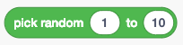
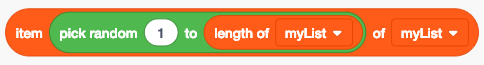

Random
======

Let’s take a look at a concept that helps make many games interesting, the concept of “random.”
If something is random, one has a difficult time predicting its behavior. Many games rely, in a
huge part, upon randomness. For instance, in a card game, the dealer will randomize the deck of
cards by shuffling the cards; which cards you get are selected from a randomly ordered deck. We
roll dice to come up with a random number between 1 & 6. In American Football, a coin is tossed
to determine which team starts the game by kicking or by receiving.

Randomness in Nature can be truly random. Computers, on the other hand, thrive on predictability
and, therefore, making something truly random on a computer is very difficult. Here at the
CoderDojo, we can attempt to use the computer’s definition of random to our advantage to help
make certain games more fun to play.

In Scratch, we have two ways of doing something randomly. We can pick a random number between a
starting number and an end number.

.. code-block:: lisp

    (pick random (1) to (10))

We can use this to select a random item from a list:

.. code-block:: lisp

    (item (pick random (1) to (length of [myList]) of [myList])

In JavaScript, we generate a random number and use that to access an item in an array or to show
a random number. Because JavaScript random numbers are a decimal between 0 and 1, we have to
multiply that random number by however many numbers we want to select from and then round that
number down to the nearest whole number. For example:

.. code-block:: javascript

    var randomize = function(things) {
        let randomNumber = Math.random() * things.length;
        let arrayItem = Math.floor(randomNumber);

        return things[arrayItem];
    };

This function will take in an array and return a random item from that array.

****************
Example Projects
****************

- Scratch: `Smack Adam <https://scratch.mit.edu/projects/222549965>`_
   - Check out the "Your" sprite for an example of how to got to a random location on the screen
- Scratch: `Random Number Generator <https://scratch.mit.edu/projects/219375454/>`_
- Scratch: `Summer Plan: Go Hiking! <https://scratch.mit.edu/projects/115901669/>`_

*************
Project Ideas
*************

- Have the target of your game appear in a random location on the screen
- Play a random note on an instrument
- Roll dice